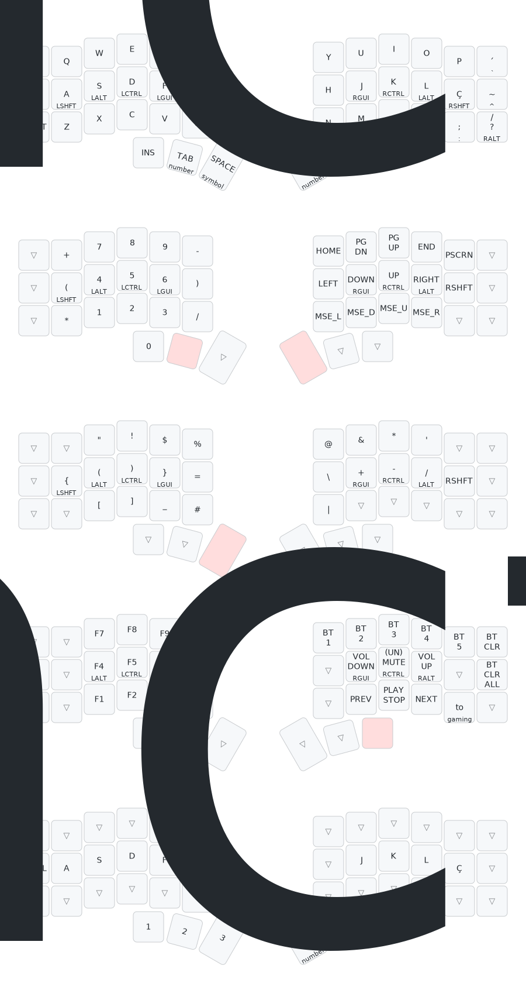

# ZMK Configuration for PT-BR Corne V3

My personal configuration for the Corne V3 keyboard. I remapped the default US layout from ZMK to the Brazilian ABNT2 layout for simplicity, which can be found in the file `config/keymap_abnt2.h`.

The configuration includes the [Timeless Homerow Mods](https://github.com/urob/zmk-config?tab=readme-ov-file#timeless-homerow-mods), which make it easier to use modifiers on the home row with minimal false positives.

## Keymap Visualization

